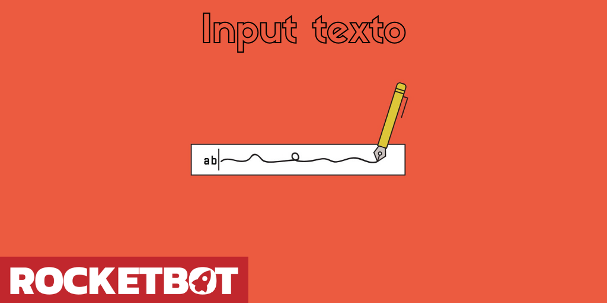

# Ingresar Texto
  
Solicita ingresar un texto y lo almacena en una variable  

*Read this in other languages: [English](Manual_Input_.md), [Português](Manual_Input_.pr.md), [Español](Manual_Input_.es.md)*
  

## Como instalar este módulo
  
Para instalar el módulo en Rocketbot Studio, se puede hacer de dos formas:
1. Manual: __Descargar__ el archivo .zip y descomprimirlo en la carpeta modules. El nombre de la carpeta debe ser el mismo al del módulo y dentro debe tener los siguientes archivos y carpetas: \__init__.py, package.json, docs, example y libs. Si tiene abierta la aplicación, refresca el navegador para poder utilizar el nuevo modulo.
2. Automática: Al ingresar a Rocketbot Studio sobre el margen derecho encontrara la sección de **Addons**, seleccionar **Install Mods**, buscar el modulo deseado y presionar install.  

## Descripción de los comandos

### Guardar Texto en variable
  
Guarda el texto ingresado en una variable
|Parámetros|Descripción|ejemplo|
| --- | --- | --- |
|Ingrese el título de la ventana|Input que permite seleccionar el título que tendrá la ventana.|Prompt|
|Ingrese el texto de la ventana|Input que permite seleccionar el texto descriptivo que tendrá la ventana.|Ingrese texto:|
|Asignar resultado a variable|Input que permite seleccionar el nombre de la variable donde se guardará el resultado.|Variable|
