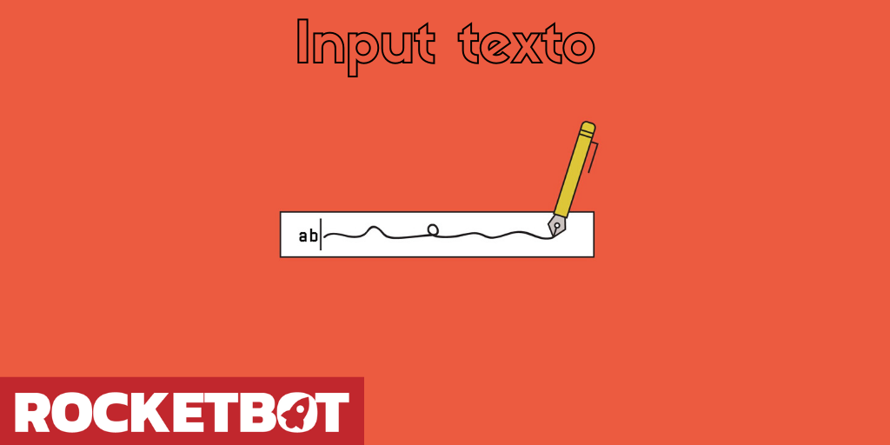

# Enter Text
  
Request to enter a text and store it in a variable  

*Read this in other languages: [English](Manual_Input_.md), [Português](Manual_Input_.pr.md), [Español](Manual_Input_.es.md)*
  

## How to install this module
  
To install the module in Rocketbot Studio, it can be done in two ways:
1. Manual: __Download__ the .zip file and unzip it in the modules folder. The folder name must be the same as the module and inside it must have the following files and folders: \__init__.py, package.json, docs, example and libs. If you have the application open, refresh your browser to be able to use the new module.
2. Automatic: When entering Rocketbot Studio on the right margin you will find the **Addons** section, select **Install Mods**, search for the desired module and press install.  

## Description of the commands

### Store text in a variable
  
Stores the entered text in a variable
|Parameters|Description|example|
| --- | --- | --- |
|Enter the window title|Input that allows you to select the title that the window will have.|Prompt|
|Enter the window text|Input that allows you to select the descriptive text that the window will have.|Ingrese texto:|
|Assign result to a variable|Input that allows you to select the name of the variable where the result will be saved.|Variable|

### Get input value
  
This command uses an alternative method (tkinter) to the 'Store text in a variable' command to get the value of an input.
|Parameters|Description|example|
| --- | --- | --- |
|Enter the window title|Input that allows you to select the title that the window will have.|Prompt|
|Enter the window text|Input that allows you to select the descriptive text that the window will have.|Ingrese texto:|
|Assign result to a variable|Input that allows you to select the name of the variable where the result will be saved.|Variable|
